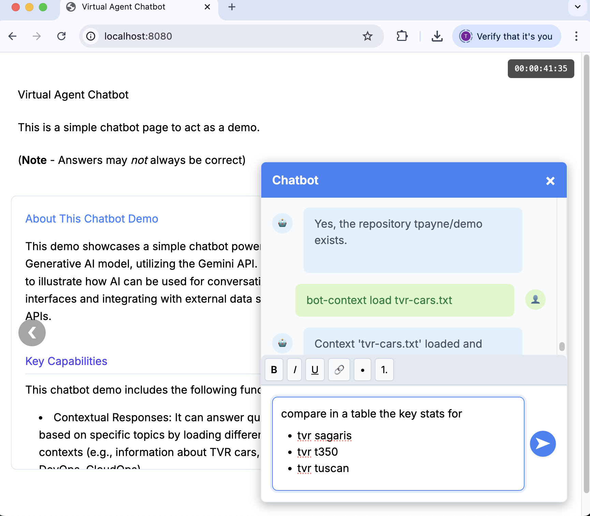
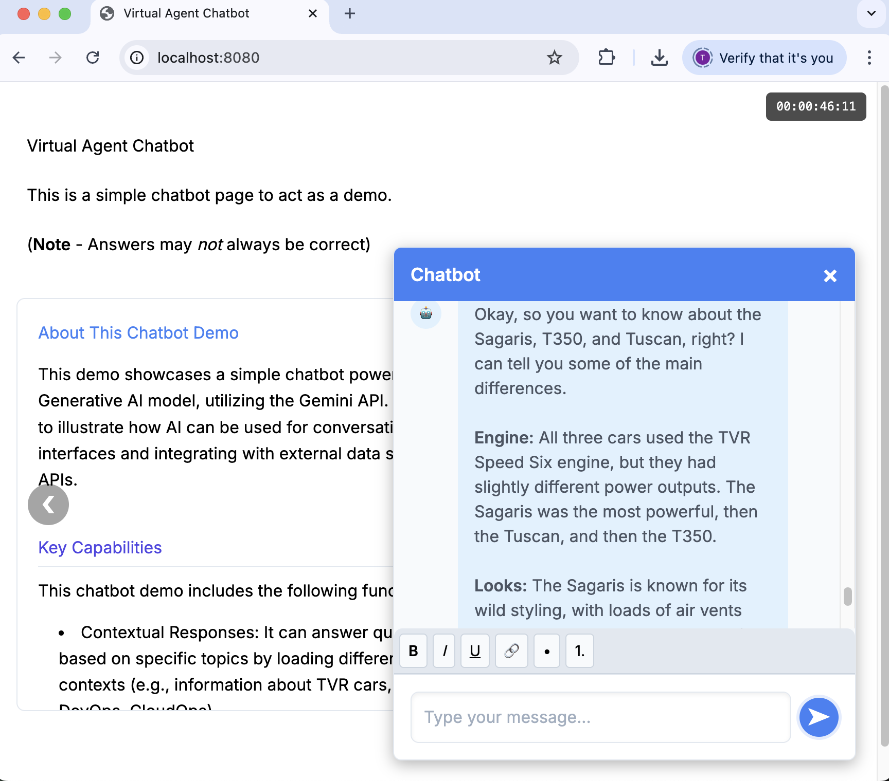

NodeJS Ollama Chatbot Sample
============================

This repo contains a simple example chatbot that runs using the Ollama API.

The web page is a very simple interface, so if you wish to create something more complex, feel free.

(Note - This sample uses a different style interface to the Python version of this bot, but the functionality is the same).

Important
---------
The models I tried do not support tool calls very well and take a long time to do anything (4 mins+). I do not recommending using Ollama unless you invest time in tuning the models and/or this code. This not something I am going to do, so regard this code as a starter only. Models lie, claim they work but then do not do anything. They can do simple one-liners, but anything complex - forget it.

Pre-Requisites
--------------
To run this sample you will need to: -
* Have Docker installed on your machine

Running the Example with Basic Ops
----------------------------------
This example creates and runs a chatbot web server.

To run this solution please do the following steps. They will build and run the sample locally. You do not need a NodeJS environment installed.

    docker build . --tag chatbot:1.0 && \
     docker run --rm -p 8080:5000 \
        -e GITHUB_TOKEN=<YourKey> \
        chatbot:1.0 

If everything has worked as expected, then you can open the chatbot on port localhost:8080, e.g.

```bash
 curl -c cookies.txt -H "Content-Type: application/json" \
    -d '{"message":"bot-context load tvr-cars.txt"}' \
    -X POST localhost:8080/chat &&\
    curl -b cookies.txt -H "Content-Type: application/json" \
    -d '{"message":"what is a tvr?"}' \
    -X POST localhost:8080/chat
{"response":"Context loaded"}{"response":"Okay, cool! So, a TVR is a British sports car. They were known for being really fast, loud, and, let's just say, a bit wild! They were built in Blackpool, England, and they're famous for their lightweight bodies and powerful engines. They don't make 'em anymore, which makes them even more special.\n"}
```
    
You have various contexts available that the bot supports. These can be accessed using...

```bash
bot-context load tvr-cars.txt
bot-context load marcos-cars.txt
bot-context load devops.txt
bot-context load cloudops.txt
```

If you use the `tvr-cars.txt`, then you can ask questions about TVRs. Similar to the Marcos sample.

If you use the `devops.txt`, then you can ask questions about DevOps and DevEx. 

If you use the `cloudops.txt`, then you can ask questions about public cloud providers. 

Sample Conversation
-------------------
The following is a sample chat about Marcos cars...

```md
You: bot-context load marcos-cars.txt

Bot: Context loaded

You: tell me about the car clubs that focus on Marcos cars?

Bot: There are a few clubs that focus on Marcos cars, mainly in the UK. The most notable is the Marcos Owners Club. It’s a great place for fans and owners to connect, share tips, and attend events. They organize meetings, shows, and even track days where members can showcase their cars. There might be some local groups or online forums too, where people share their passion for Marcos. If you're interested in joining, those clubs usually have websites where you can find more info on membership and events!

You: tell me about the Marcos Mantis?

Bot: The Marcos Mantis is a cool sports car made by Marcos Engineering, a British company known for building unique and lightweight cars. The Mantis was produced mainly in the late 1970s and early 1980s. It was designed for performance, with a focus on handling and speed. The car had a sleek, aerodynamic look, often featuring a fiberglass body, which helped keep it light. Under the hood, it usually had different engine options, including V6 or V8 engines, giving it a lot of power. The Mantis is pretty rare today, making it a special find for car collectors and enthusiasts. It's admired for its distinct design and the driving experience it offers. If you’re into sports cars with a lot of character, the Mantis is definitely worth learning about!

You: tell me about the 1997 Marcos Mantis and give me detailed technical specifications

Bot: The 1997 Marcos Mantis is a cool sports car known for its unique design and performance. Here are some detailed technical specifications: 1. **Engine**: It typically features a V8 engine, specifically a 4.0 or 4.6-liter Ford V8, which produces around 280-320 horsepower depending on the calibration. 2. **Transmission**: It usually comes with a 5-speed manual gearbox, allowing for a fun driving experience. 3. **Weight**: The Mantis is quite light for a sports car, weighing about 1,050 kg (2,310 lbs), thanks to its fibreglass body. 4. **Performance**: It can go from 0 to 60 mph in around 4.0 to 4.5 seconds, which is impressive for its time. 5. **Top Speed**: The top speed is generally around 150 mph (240 km/h). 6. **Chassis**: The Mantis uses a tubular steel chassis that adds to its strength and rigidity while keeping the weight low. 7. **Brakes**: It has disc brakes on all four corners for good stopping power. 8. **Suspension**: The car is equipped with independent suspension, both at the front and rear, for better handling. This combination of specs makes the Mantis a thrilling car to drive, and it's a collector's item today among Marcos enthusiasts!
```

Some GUI samples are shown below...

**Car Chat...**





Adding Custom Contexts
----------------------
If you want to add your own custom context for the bot to use, then you can do the following...

```bash
cd contexts
cp tvr-cars.txt <custom-context>.txt
```

Then edit the `<custom-context>.txt` to specify the rules you want as appropriate.

You can then load it into the chatbot using the `bot-context load` command once the image is built.

Interacting with GitHub
-----------------------
A few sample chatbot actions have been created that show how the AI can be integrated with REST APIs.

A few samples are

```bash
 curl -c cookies.txt -H "Content-Type: application/json" \
    -d '{"message":"bot-context load devops.txt"}' \
    -X POST localhost:8080/chat && \
    curl -b cookies.txt -H "Content-Type: application/json" \
    -d '{"message":"list all the branches in the github repo CloudFunctions that is owned by the user tpayne"}' \
    -X POST localhost:8080/chat

 curl -c cookies.txt -H "Content-Type: application/json" \
    -d '{"message":"bot-context load devops.txt"}' \
    -X POST localhost:8080/chat && \
    curl -b cookies.txt -H "Content-Type: application/json" \
    -d '{"message":"list all the files in the github repo CloudRun that is owned by the user tpayne"}' \
    -X POST localhost:8080/chat
```

GitHub support is added for:
* Creating a pull request for a branch to merge
* Fetch files from a repo (for processing them in the future)
* Listing branches in a repo
* Listing build jobs (actions)
* Listing commit history for a file
* Listing repos owned by a user
* Listing the files in a repo
* Downloading a repo or part of a repo
* Creating repos
* Creating branches
* Uploading code to repos

This can be used to work with the bot to generate code and commit it to repos. 

For example, you can do things like - using this verbage - into the tool: -

* Create a private repo under user tpayne called demo and upload to that repo a terraform module for creating a azure sql postgres database in a secured network only acessible from an ip range inputed into the module
* Create a branch called demo under the repo tpayne/demo and upload to it example terraform code for creating a compute instance in a network
* Review the code in the repo tpayne/demo on the branch demo and update the `README.md` for the code in on that branch
* Review the code in the repo tpayne/demo on the branch demo and update any files you like with improvements for security

Although, this support is dependent on the capabilities of the AI, so verbage may have to change.

Similar support for use with Azure DevOps (ADO) has also been added for the above. To make use of it, you need to create an ADO PAT token and export it into the environment using: -

* AZURE_DEVOPS_PAT

You will need to indicate to the bot you are using ADO, not GitHub when making requests.

Automated Code Reviews
----------------------
As part of interactions with GitHub, a capability was added that allows automated code reviews of all or part of a GitHub repo. This is based on the AIs capability to review code and suggest improvements based on your questions.

For example, you could ask for...
* General improvements
* Security reviews
* Efficiency improvements and bug detection
* Enhancements to formatting
* Code documentation etc.

The command format is something like...

```bash
curl -c cookies.txt -H "Content-Type: application/json" \
    -d '{"message":"bot-context load developer.txt"}' \
    -X POST localhost:8080/chat && \
curl -b cookies.txt -H "Content-Type: application/json" \
    -d '{"message":"please perform a detailed code review of the files under the directory samples/DemoApp/src/main/java/  in the github repo tpayne/CloudRun and tell me improvements for the content to make it more efficient"}' \
     -X POST localhost:8080/chat

curl -c cookies.txt -H "Content-Type: application/json" \
    -d '{"message":"bot-context load developer.txt"}' \
    -X POST localhost:8080/chat && \
curl -b cookies.txt -H "Content-Type: application/json" \
    -d '{"message":"please perform a security review of the terraform code in the github repo tpayne/terraform-examples under the directory samples/Azure/templates/modules and give me a security analysis of the content. Let me know if there are any security issues I should fix"}' \
    -X POST localhost:8080/chat

curl -c cookies.txt -H "Content-Type: application/json" \
    -d '{"message":"bot-context load developer.txt"}' \
    -X POST localhost:8080/chat && \
curl -b cookies.txt -H "Content-Type: application/json" \
    -d '{"message":"please perform a security review of the terraform code in the github repo tpayne/terraform-examples and give me a security analysis of the content. Let me know if there are any security issues I should fix"}' \
    -X POST localhost:8080/chat
```

Notes:
- The process will take time if you are asking for a lot of code to be reviewed
- Error handling could be improved. I have not tested lots of different error conditions.
- You may also run into model limits if processing lots of info

DOSA Functionality
------------------
The chatbot has the capability of interacting with the DOSA REST API.

To run the DOSA functionality, you will need to be registered to use the API and set the following: -
* DOSA_API_KEY - Your API KEY for DOSA usage
* DOSA_API_SECRET - Your API SECRET for DOSA usage
* DOSA_CLIENT_ID - Your CLIENT ID for DOSA usage
* DOSA_AUTH_TENANT_ID - Your MSN TENANTID for DOSA usage

Setting these will allow queries to be run on the DOSA MOT history database.

```bash
curl -H "Content-Type: application/json" \
    -d '{"message":"bot-context load tvr-cars.txt"}' \
    -X POST localhost:8080/chat &&\
curl -H "Content-Type: application/json" \
    -d '{"message":"give me the mot history for the car ABC123"}' \
    -X POST localhost:8080/chat

curl -H "Content-Type: application/json" \
    -d '{"message":"bot-context load tvr-cars.txt"}' \
    -X POST localhost:8080/chat &&\
curl -H "Content-Type: application/json" \
    -d '{"message":"tell me all the MOT defects for ABC123"}' \
    -X POST localhost:8080/chat
```

Database Integration
--------------------
This chatbot can interact with a database that is connected to via a JDBC connection. To enable this, you need to set the following environment variable when running the Docker container:

* DATABASE_URI - The JDBC connection string for your database

Although this string does not need to be used directly as the bot can connect to any database given the URI format.

The bot allows any SQL to be run based on the request that you pass down. Examples might be:

* Connect to a database given a JDBC URI
* Listing tables, views or other schema objects
* Running CRUD operations on that objects
* Identifying data quality issues
* Identifying PII data
* Identifying inconsistent or invalid data
* Fixing data quality issues & inconsistencies once identified

And others.

Note - Whilst the code supports a wide range of common RDBMS like Postgres, Oracle, MySQL, MongoDB, MS/SQL etc., only MySQL has been tested, so if you want to use the others you may have to change the code for any issues arising. This was only a test PoC for database integration, so I have not validated lots of RDBMs.

Example usage is shown below...

```bash
You: connect to the schema my_company_db in the database jdbc:mysql://localhost:3306/my_company_db?user=root

Bot: I am now connected to the database my_company_db at jdbc:mysql://localhost:3306/my_company_db using the user root. If you need any specific operations to be performed on this database schema, such as querying data, updating records, or any other database-related tasks, please let me know!

You: what tables are in here?

Bot: Here are the tables present in the schema my_company_db:

customer_details
invoice
order_items
orders
products
stock
suppliers

If you need further information about any specific table or want to perform actions related to these tables, feel free to ask!

You: what pii data is in suppliers?

Bot: The suppliers table contains the following Personally Identifiable Information (PII) data:

Supplier ID	Supplier Name	Contact Person	Phone	Email	Address
5	Office Essentials	David Lee	555-1005	david.lee@officeessentials.com	50 Business Blvd, Corpville

The PII data included here is:
Contact Person: David Lee
Phone: 555-1005
Email: david.lee@officeessentials.com
Address: 50 Business Blvd, Corpville

If you need any more information or specific operations regarding this data, just let me know!
```

Kubernetes Integration
----------------------
This chatbot can interact with a Kubernetes cluster to retrieve information about its resources. To enable this functionality, you need to set the following environment variables when running the Docker container:

* KUBERNETES_API_ENDPOINT - The base URL for your Kubernetes API server (e.g., https://host.docker.internal:6443).
* KUBERNETES_BEARER_TOKEN - The bearer token for authentication with the Kubernetes API. A sample `Kubernetes/role.yml` is provided to help generate the token.

Available Kubernetes Functions:

The following functions are available for interacting with Kubernetes. Many of these functions support an optional namespace parameter to filter results to a specific namespace. If the namespace parameter is omitted, the function will list resources across all accessible namespaces (where applicable).

* Get the Kubernetes cluster version.
* Get logs for a specific pod.
* List all namespaces in the Kubernetes cluster.
* List Kubernetes deployments (optional namespace).
* List Kubernetes services (optional namespace).
* List Kubernetes pods (optional namespace).
* List Kubernetes ReplicaSets (optional namespace).
* List Kubernetes DaemonSets (optional namespace).
* List Kubernetes StatefulSets (optional namespace).
* List Kubernetes Ingresses (optional namespace).
* List Kubernetes ConfigMaps (optional namespace).
* List Kubernetes PersistentVolumes (cluster-scoped, no namespace parameter).
* List Kubernetes PersistentVolumeClaims (optional namespace).
* List Kubernetes Jobs (optional namespace).
* List Kubernetes CronJobs (optional namespace).

Example Usage:

To list all pods in the default namespace:

```bash
curl -c cookies.txt -H "Content-Type: application/json" \
    -d '{"message":"bot-context load cloudops.txt"}' \
    -X POST localhost:8080/chat && \
    curl -b cookies.txt -H "Content-Type: application/json" \
    -d '{"message":"list all kubernetes pods in the default namespace"}' \
    -X POST localhost:8080/chat
```

To get the Kubernetes cluster version:

```bash
curl -c cookies.txt -H "Content-Type: application/json" \
    -d '{"message":"bot-context load cloudops.txt"}' \
    -X POST localhost:8080/chat && \
    curl -b cookies.txt -H "Content-Type: application/json" \
    -d '{"message":"get the kubernetes version"}' \
    -X POST localhost:8080/chat
```

Other samples can include things like: -
* Tell me the pods running on my k8s install?
* Get me the pod logs for the core-dns ones
* Are there any issues shown in the pod logs for core-dns ones?

Cleaning Up
-----------
To clean up the installation, do the following...

    docker rmi chatbot:1.0
        
This will delete all the items created in your session.

Notes
-----
* This code does not have any unit testing or SA analysis run as part of the process
* Sample actions have been added to allow you to interact GitHub REST API (use the cloudops context)
* You will have to select the model that best suits your need and then modify all the files that use the model to get the right one
* The models I tried do not support tool calls very well and take a long time to do anything (4 mins+). I do not recommending using Ollama unless you invest time in tuning the models and/or this code. This not something I am going to do
* Use this code as a starter for 10, not a final product

References
----------
* [Ollama Home](https://ollama.com/)
* [Ollama Models](https://ollama.com/search)
* [NodeJS](https://github.com/ollama/ollama-js/tree/main)


