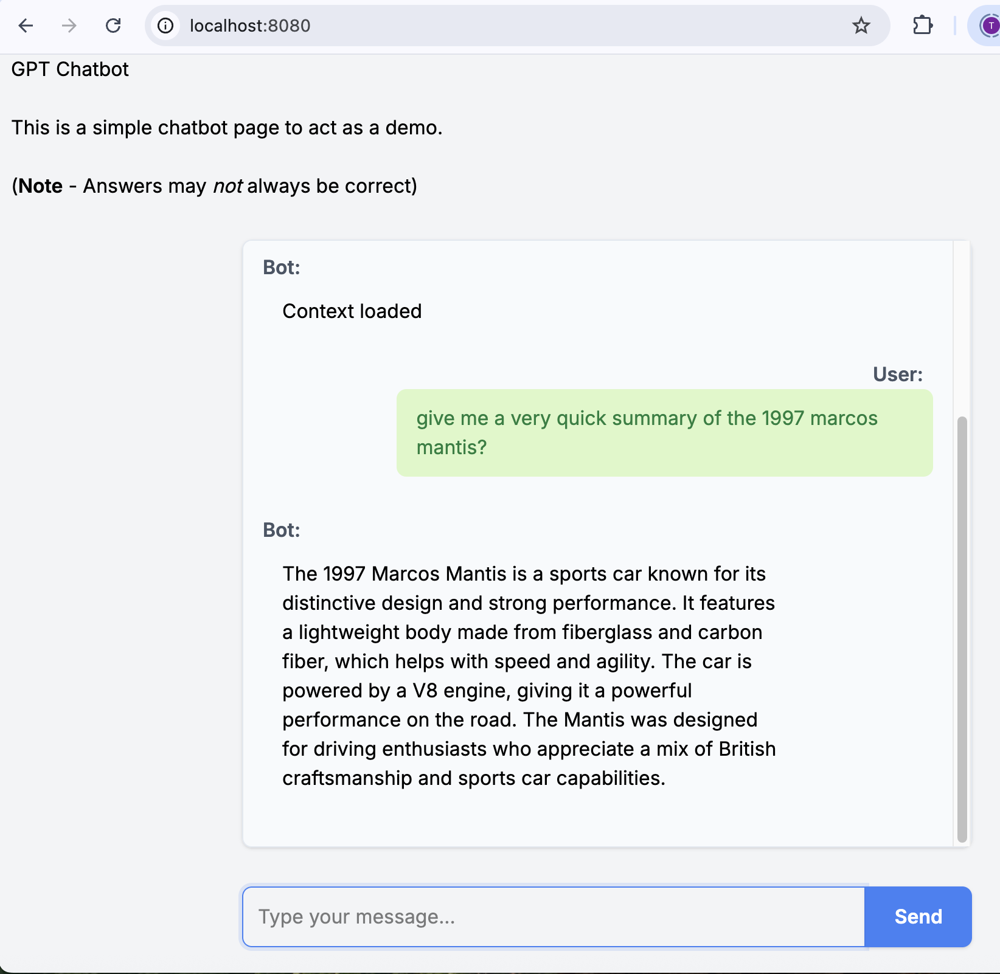
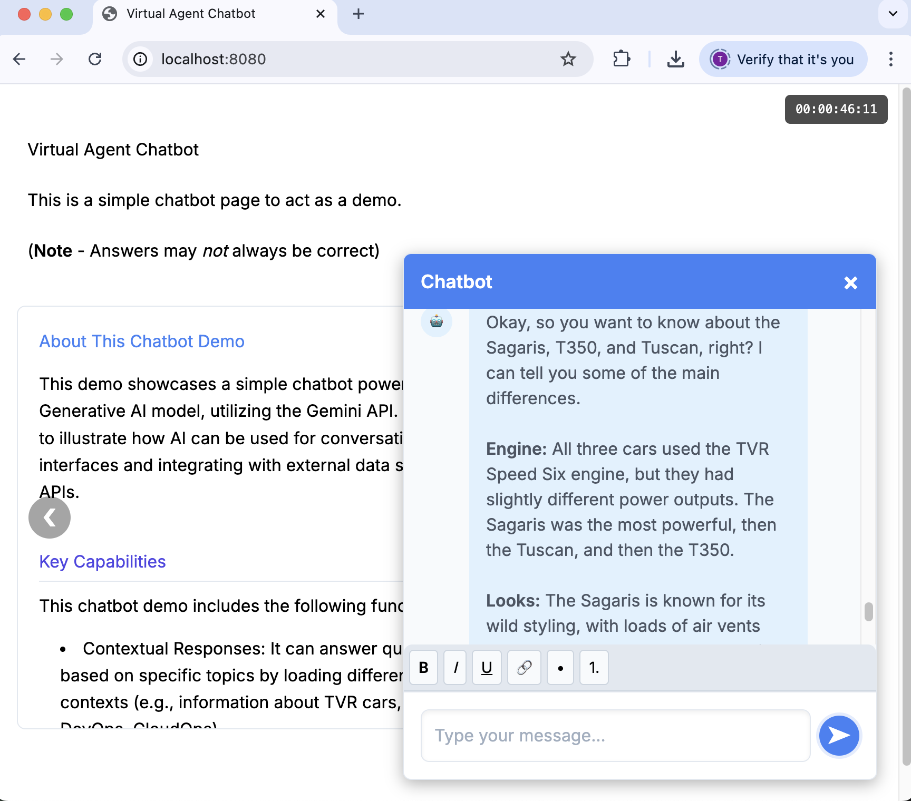

NodeJS GPT Chatbot Sample
==================

This repo contains a simple example chatbot that runs using the ChatGPT API.

The web page is a very simple interface, so if you wish to create something more complex, feel free.

(Note - This sample uses a different style interface to the Python version of this bot, but the functionality is the same).

Pre-Requisites
--------------
To run this sample you will need to: -
* Have Docker installed on your machine
* Have an OpenAI account created with an OPENAI_API_KEY that you can use for interacting with the OpenAI API

Running the Example with Basic Ops
----------------------------------
This example creates and runs a chatbot web server.

To run this solution please do the following steps. They will build and run the sample locally. You do not need a NodeJS environment installed.

    docker build . --tag chatbot:1.0 && \
     docker run --rm -p 8080:5000 \
        -e OPENAI_API_KEY=<YourKey> \
        chatbot:1.0 

If everything has worked as expected, then you can open the chatbot on port localhost:8080.
    
You have various contexts available that the bot supports. These can be accessed using...

```bash
bot-context load tvr-cars.txt
bot-context load marcos-cars.txt
bot-context load devops.txt
bot-context load cloudops.txt
```

If you use the `tvr-cars.txt`, then you can ask questions about TVRs. Similar to the Marcos sample.

If you use the `devops.txt`, then you can ask questions about DevOps and DevEx. 

If you use the `cloudops.txt`, then you can ask questions about public cloud providers. 

Sample Conversation
-------------------
The following is a sample chat about Marcos cars...

```md
You: bot-context load marcos-cars.txt

Bot: Context loaded

You: tell me about the car clubs that focus on Marcos cars?

Bot: There are a few clubs that focus on Marcos cars, mainly in the UK. The most notable is the Marcos Owners Club. It’s a great place for fans and owners to connect, share tips, and attend events. They organize meetings, shows, and even track days where members can showcase their cars. There might be some local groups or online forums too, where people share their passion for Marcos. If you're interested in joining, those clubs usually have websites where you can find more info on membership and events!

You: tell me about the Marcos Mantis?

Bot: The Marcos Mantis is a cool sports car made by Marcos Engineering, a British company known for building unique and lightweight cars. The Mantis was produced mainly in the late 1970s and early 1980s. It was designed for performance, with a focus on handling and speed. The car had a sleek, aerodynamic look, often featuring a fiberglass body, which helped keep it light. Under the hood, it usually had different engine options, including V6 or V8 engines, giving it a lot of power. The Mantis is pretty rare today, making it a special find for car collectors and enthusiasts. It's admired for its distinct design and the driving experience it offers. If you’re into sports cars with a lot of character, the Mantis is definitely worth learning about!

You: tell me about the 1997 Marcos Mantis and give me detailed technical specifications

Bot: The 1997 Marcos Mantis is a cool sports car known for its unique design and performance. Here are some detailed technical specifications: 1. **Engine**: It typically features a V8 engine, specifically a 4.0 or 4.6-liter Ford V8, which produces around 280-320 horsepower depending on the calibration. 2. **Transmission**: It usually comes with a 5-speed manual gearbox, allowing for a fun driving experience. 3. **Weight**: The Mantis is quite light for a sports car, weighing about 1,050 kg (2,310 lbs), thanks to its fibreglass body. 4. **Performance**: It can go from 0 to 60 mph in around 4.0 to 4.5 seconds, which is impressive for its time. 5. **Top Speed**: The top speed is generally around 150 mph (240 km/h). 6. **Chassis**: The Mantis uses a tubular steel chassis that adds to its strength and rigidity while keeping the weight low. 7. **Brakes**: It has disc brakes on all four corners for good stopping power. 8. **Suspension**: The car is equipped with independent suspension, both at the front and rear, for better handling. This combination of specs makes the Mantis a thrilling car to drive, and it's a collector's item today among Marcos enthusiasts!
```

Some GUI samples are shown below...

**Marcos Chat...**





Adding Custom Contexts
----------------------
If you want to add your own custom context for the bot to use, then you can do the following...

```bash
cd contexts
cp tvr-cars.txt <custom-context>.txt
```

Then edit the `<custom-context>.txt` to specify the rules you want as appropriate. Please refer to [here](https://help.openai.com/en/articles/10032626-prompt-engineering-best-practices-for-chatgpt) for guidance on how to modify the context file.

You can then load it into the chatbot using the `bot-context load` command once the image is built.


Interacting with GitHub
-----------------------
A few sample chatbot actions have been created that show how the AI can be integrated with REST APIs.

A few samples are

```bash
 curl -H "Content-Type: application/json" \
    -d '{"message":"bot-context load cloudops.txt"}' \
    -X POST localhost:8080/chat && \
    curl -H "Content-Type: application/json" \
    -d '{"message":"list all the branches in the github repo CloudFunctions that is owned by the user tpayne"}' \
    -X POST localhost:8080/chat

 curl -H "Content-Type: application/json" \
    -d '{"message":"bot-context load cloudops.txt"}' \
    -X POST localhost:8080/chat && \
    curl -H "Content-Type: application/json" \
    -d '{"message":"list all the files in the github repo CloudRun that is owned by the user tpayne"}' \
    -X POST localhost:8080/chat
```

Cleaning Up
-----------
To clean up the installation, do the following...

    docker rmi chatbot:1.0
        
This will delete all the items created in your session.

Notes
-----
* This code does not have any unit testing or SA analysis run as part of the process
* Sample actions have been added to allow you to interact GitHub REST API (use the cloudops context)

References
----------
- [OpenAI Platform](https://platform.openai.com/docs/models/gpt-4o-mini)
- [OpenAI Introduction](https://openai.com/api/)
- [Developer APIs](https://platform.openai.com/docs/overview)
- [Useful notes](https://medium.com/@Doug-Creates/nightmares-and-client-chat-completions-create-29ad0acbe16a)
- [Models](https://platform.openai.com/docs/models/gpt-4o-mini)
- [NodeJS API](https://github.com/openai/openai-quickstart-node)


